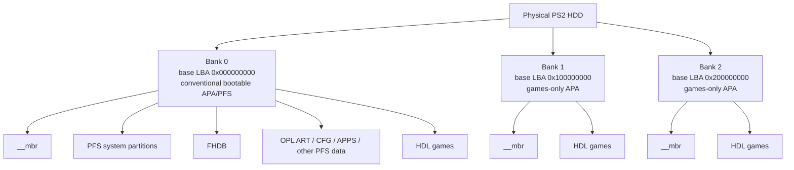

# Extended APA / Banked APA

Open PS2 Loader Extended APA extends the traditional PlayStation 2 APA/PFS hard-drive layout beyond the classic single 32-bit APA address space by dividing a large physical HDD into independent APA banks.

This keeps the normal PS2 system area conventional while allowing additional HDL game partitions to live above the traditional 2 TiB APA boundary.

## Layout



## Address translation

Each bank retains ordinary 32-bit, bank-relative APA addresses internally. The modified OPL HDD path associates each discovered APA chain with a bank index and translates relative LBAs into physical LBAs when reading game metadata and launching games.

The translation is:

```text
bank_base_lba = bank_index * 0x100000000
physical_lba  = bank_base_lba + relative_lba
```

With 512-byte logical sectors, each full bank spans:

```text
0x100000000 sectors * 512 bytes = 2 TiB
```

### Examples

```text
Bank 0, relative LBA 0x00001000
physical = 0x000000000 + 0x00001000
         = 0x00001000

Bank 1, relative LBA 0x00001000
physical = 0x100000000 + 0x00001000
         = 0x100001000

Bank 2, relative LBA 0x00123456
physical = 0x200000000 + 0x00123456
         = 0x200123456
```

## Bank rules

### Bank 0

Bank 0 starts at physical LBA `0x000000000` and remains the conventional PS2 APA/PFS system bank.

It may contain:

- the normal APA `__mbr`;
- PFS system partitions;
- FHDB / FreeHDBoot data;
- the OPL executable and OPL configuration;
- `ART`, `CFG`, `APPS`, `VMC`, `CHT`, themes and other normal OPL/PFS data;
- ordinary HDL game partitions.

Keeping Bank 0 conventional is deliberate. The PS2 boot path, FHDB and ordinary PFS data do not need to know about upper banks.

### Bank 1 and higher

Upper banks start at successive `0x100000000`-sector boundaries and are initialized as independent, games-only APA chains with their own `__mbr`.

They are intended to contain HDL game partitions only. OPL configuration, FHDB, artwork and normal PFS storage stay in Bank 0.

This lets a Bank 1 game use the same artwork and configuration stored in Bank 0.

## Why not replace APA with another filesystem?

Official OPL also supports exFAT-based HDD layouts, but Extended APA has a different goal: retain Sony's original APA/PFS-style internal-HDD environment, including FHDB compatibility and conventional Bank 0 behavior, while extending game storage beyond the old single-bank limit.

The design therefore extends the existing model instead of replacing it.

## Real-hardware validation

The initial public release was validated on a real PlayStation 2 using a 4 TB HDD prepared with PS2 HDD Manager.

Validated behavior:

- FHDB boot path works from Bank 0.
- Bank 0 HDL games are detected and launch.
- Bank 1 HDL games are detected and launch.
- OPL artwork/configuration stored in Bank 0 works for Bank 1 games.
- Bank 0 remains the normal APA/PFS system and application area.

For the tested 4 TB decimal HDD used during development, the layout was approximately:

```text
Bank 0: 0x000000000 .. <0x100000000  = 2.00 TiB
Bank 1: 0x100000000 .. end of disk   = ~1.64 TiB
```

## Tested build

The first hardware-tested loader code is commit:

```text
b2e39f0d6b569cf79a3235dc47050016d102cd31
```

The matching release ELF is intentionally pinned to that tested build. Later source changes should not silently replace the known-good release binary until they have also been validated on real hardware.

## Compatibility and safety

Extended APA is experimental and requires both sides of the layout to agree:

- a compatible formatter/writer must create the banked APA layout; and
- a matching OPL Extended APA build must be used to enumerate and launch games from Bank 1+.

For ordinary APA HDDs up to 2 TiB, official Open PS2 Loader remains the recommended choice unless Extended APA-specific behavior is required.
