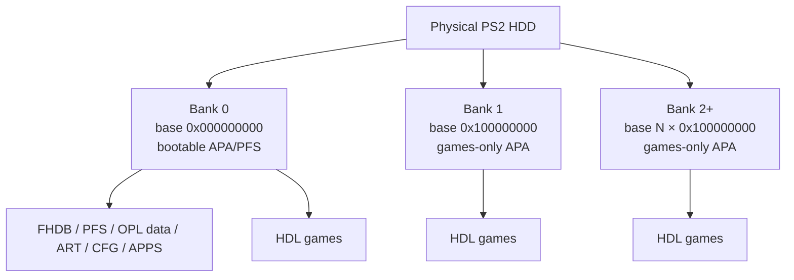

# Open PS2 Loader Extended APA


**Open PS2 Loader Extended APA** is an experimental Open PS2 Loader fork that keeps the PlayStation 2's APA/PFS internal-HDD environment while extending game storage beyond the traditional single 32-bit APA bank.

It is the companion OPL build for **PS2 HDD Manager** when formatting an internal HDD larger than 2 TiB using **Extended APA / banked APA** mode.

> [!IMPORTANT]
> For ordinary APA HDDs up to 2 TiB, use the official Open PS2 Loader unless you specifically need Extended APA support. A >2 TiB Extended APA disk must be prepared by a compatible formatter/writer.

## Hardware-tested status

The first release has been validated on real PlayStation 2 hardware with a 4 TB HDD:

- **FHDB / FreeHDBoot boot:** working
- **Bank 0 game scan + launch:** working
- **Bank 1 game scan + launch:** working
- **OPL artwork/config stored in Bank 0 and used by Bank 1 games:** working
- **Conventional APA/PFS system area retained in Bank 0:** working

The exact loader code used for that hardware test is commit:

```text
b2e39f0d6b569cf79a3235dc47050016d102cd31
```

## How Extended APA works

A large HDD is divided into independent APA banks. Each bank continues to use ordinary bank-relative 32-bit APA addresses; OPL adds the bank base when accessing the physical disk.



The physical address translation is:

```text
bank_base_lba = bank_index * 0x100000000
physical_lba  = bank_base_lba + relative_lba
```

With 512-byte logical sectors, one full bank spans exactly 2 TiB:

```text
0x100000000 sectors × 512 bytes = 2 TiB
```

Bank 0 remains conventional and contains FHDB, normal PFS system/application data, OPL configuration, artwork and optionally games. Bank 1+ are games-only APA banks.

For the full technical explanation, examples and compatibility model, see **[EXTENDED_APA.md](EXTENDED_APA.md)**.

## First release

**`v1.2.0-Beta-2273-Extended-APA-1`**

The attached ELF is the exact CI-produced binary from the successful Bank 0 + Bank 1 hardware test. The release includes a SHA-256 checksum so tools such as PS2 HDD Manager can pin and verify the known-good build instead of silently following development HEAD.

## Intended setup path

The normal workflow is:

```text
PS2 HDD Manager
      ↓
select Extended APA for >2 TiB HDD
      ↓
create conventional Bank 0 + games-only Bank 1+
      ↓
install FHDB / OPL data into Bank 0
      ↓
download and install the pinned Open PS2 Loader Extended APA release
      ↓
install HDL games into Bank 0 or upper banks
```

All artwork, apps and OPL configuration remain in Bank 0 and are shared by games discovered in the upper banks.

## Relationship to upstream OPL

This project is based on **Open PS2 Loader** by the OPL contributors. The Extended APA changes are focused specifically on preserving APA/PFS while adding bank-aware HDD game enumeration and launch support above 2 TiB.

Upstream project: https://github.com/ps2homebrew/Open-PS2-Loader

For standard OPL documentation, normal releases and general compatibility information, use the upstream repository.

## License and credits

Copyright 2013, Ifcaro & jimmikaelkael and Open PS2 Loader contributors.

Licensed under the **Academic Free License version 3.0**. See [LICENSE](LICENSE) and [CREDITS](CREDITS).

Extended APA work and hardware testing maintained by **VajskiDs / L10N37**.
